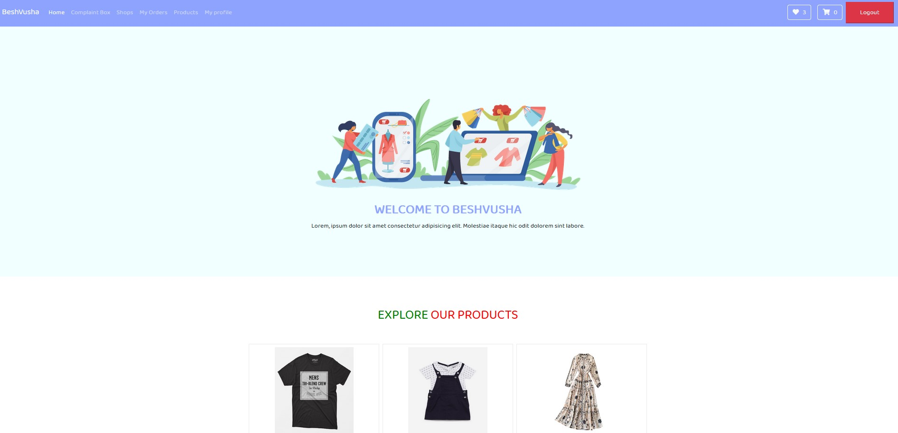

#Customer

**Customer's Page**:

* ComplaintBox
	* User can complain from here
* Shops
	* User can see available shops
* My Orders
	* User can see their Orders from here
* Products
	* User can see the available products and search them from there
* My Profile
	* User can see their profile
* Wishlist
	* Briefly describe in feature description part
* Shopping Cart
	* Briefly describe in feature description part  
* Logout
