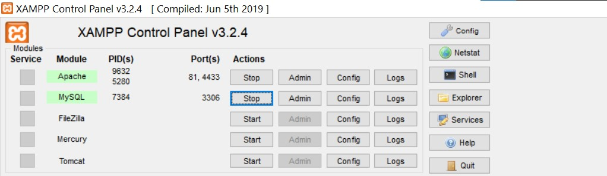

#How to run

1. **First you have to import database in xampp,then open xampp and start running mysql and apache server.
 **
2. **Then go to a browser and type ``` localhost:81/beshvusha/ ``` here 81 is an apache server port you can change it from xampp and use another one.(Default value of the port is **80**)**