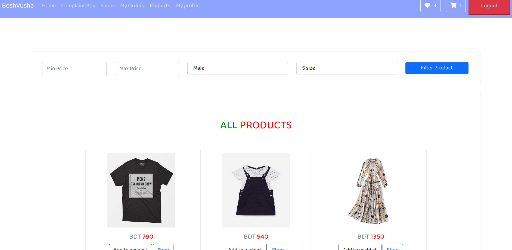
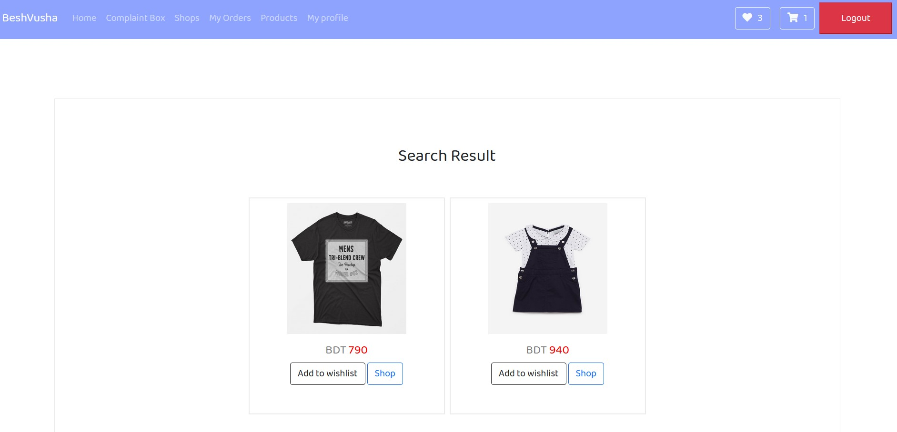

#Order Filtering System

####Description

Customers can filter their products searching by some criteria.

####How to filter the pruducts?

1. After clicking ```Products``` the page will appear where customers can filter products by writing a Minimum price in **Min Price** field,Maximum Price in **Max Price** field,choosing **Male,Female,Kids** option and select size from **Size** field.Then click on ```Filter Product``` button.


2. Here, Customers can see filtered products in **Search Result** area.