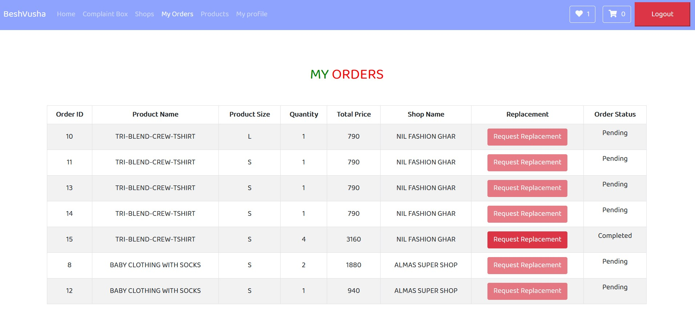
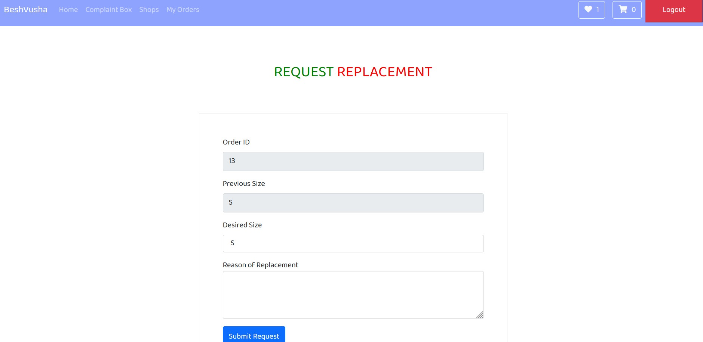

#Product Replacement Request

####Description

Customer can replace their delivered products within a time limit.The time limit will set by the shop owners.

####How to request for replacement?
1. After clicking ```My Orders``` from HOMEPAGE the page will appear where customers can click on ```Request Replacement``` button from **MY ORDERS** section in the page.```Request Replacement``` button will be disabled if the product is in **pending** stage or already requested for replacement.

2.After clicking ```Request Replacement``` button now customers can set their desired size from **Desired Size** field and give a note on **Reason of Replacement** about the reason for replacement request.Then click on ```Submit Request``` button.
