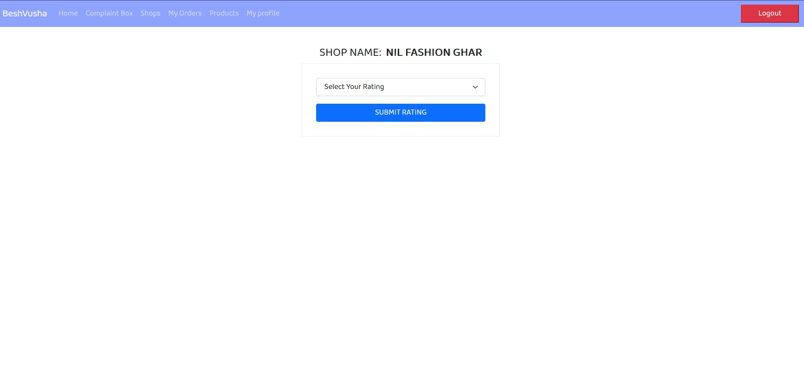
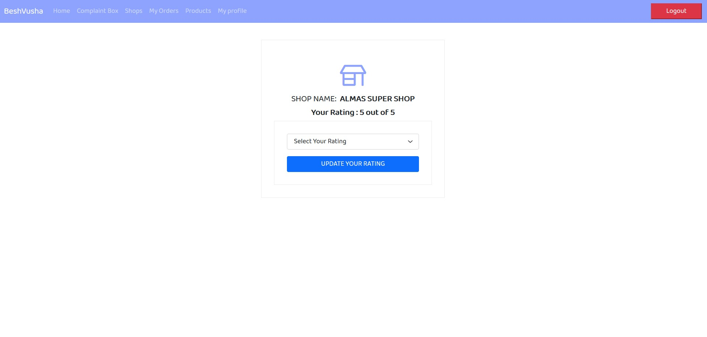

#Rating 

####Description
Customers can rate individual shops and also update their rating later.

####How to rate a shop?
1. After clicking ```Shops``` from HOMEPAGE the page will appear where customers can click on ```Rate Shop``` button which is attached with every shown shop in the page. 

2. Here they can choose rating from **1 to 5** from the **Select Your Rating** option.Then press the ```SUBMIT RATING``` button.Rating will be submitted.

####How to see given rating and update rating?

Clicking  ```Rate Shop``` button customers can see their given rating if rating is already given and they can update it from **Select Your Rating** option and click on ```UPDATE YOUR RATING``` button.It will be updated.