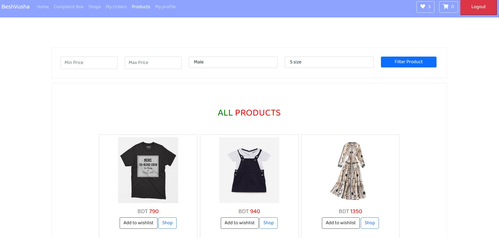
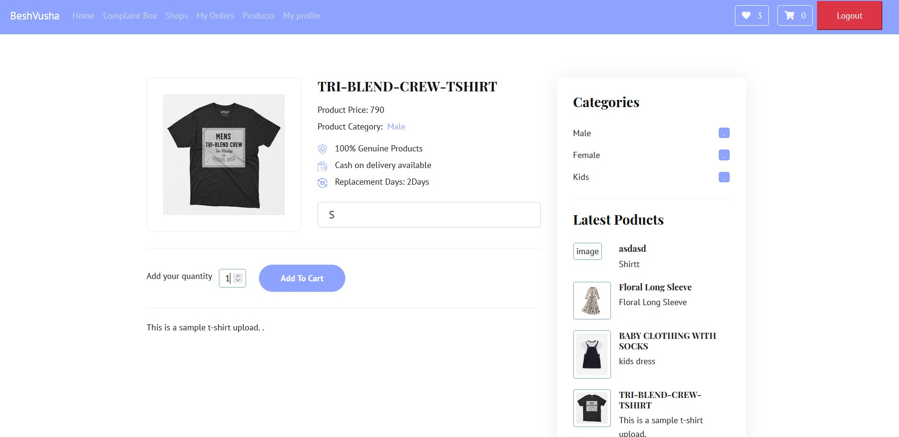
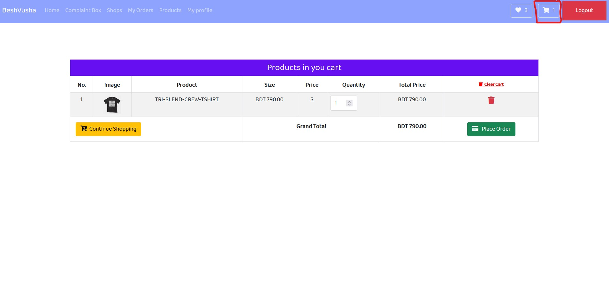

#Shopping Cart

####Description
Customers can add a product to cart.After that they can see the cart and if they want to update quantity they can do that.Finally they can place an order from the cart.

####How to add a product to cart?
1. First click ```Shop``` from a shown product.
2. Then, from this page add quantity in **Add your quantity Text Field**  then press the button ```Add To Cart```.It will then add the product to cart

####How to check the cart?
By clicking the sign which is marked in the image(top right corner) customers can see added products in the cart.Customers can increase or decrease quantity from ```Quantity```,can delete a product,can clear the cart and finally they can place order by clicking ```Place Order```.