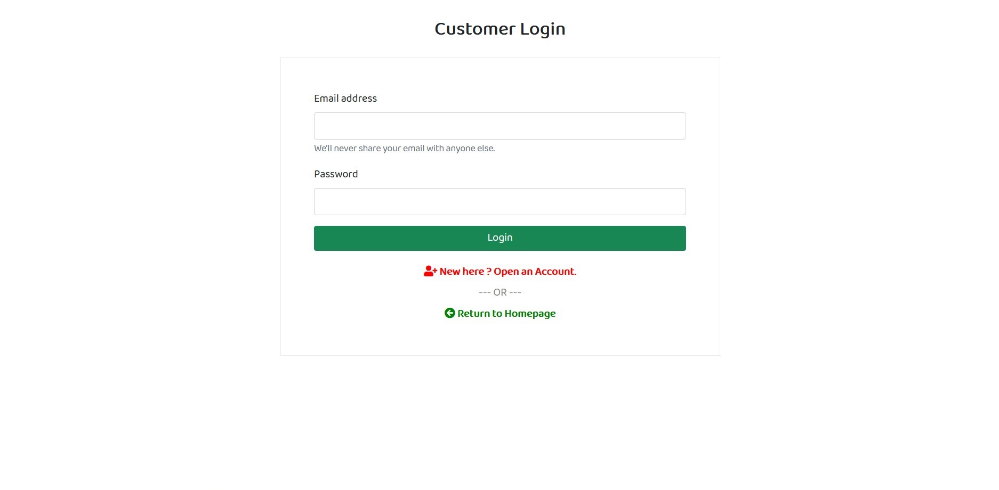
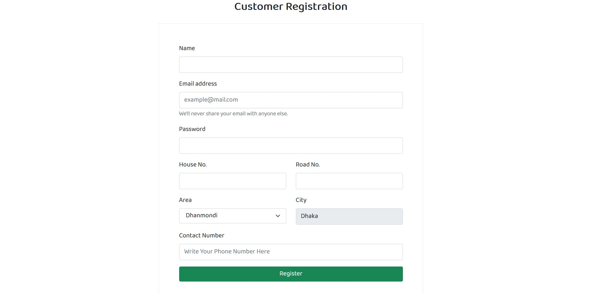

#Sign In/Sign Up

####Description
User can sign in by giving email and password after sign up and admin approval is required for shop owner.

####How to do? 

* **Sign in**: From **HOME** page user can click ```login``` and by filling these information they can login if they are valid user.
* **Sign up**: From **HOME** page by clicking ```Signup``` or from **LOGIN** page by clicking ```New here?Open an Account?``` and filling up the information they can sign up and waiting for confirmation if the user is **Shop Owner**  
